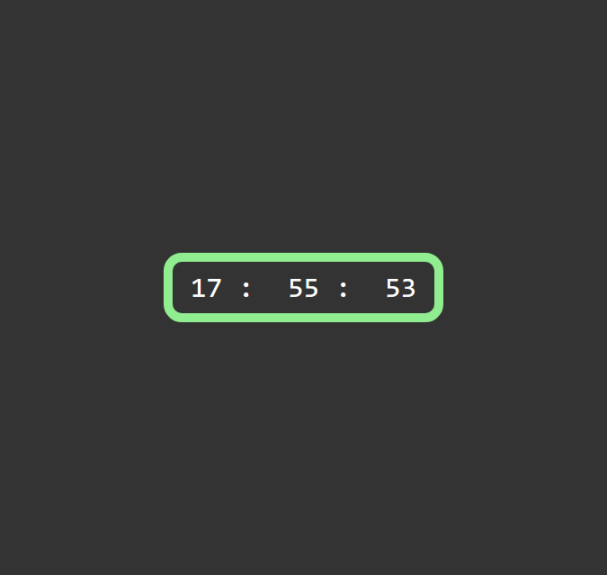

## Digital Clock App


#### Link to the live website:
>[Digital Clock](https://devdigitalclock.netlify.app/ "Digital clock live site")
___

#### Description 
>Digital clock is a web app made with Js for showing the current time on a webpage it works by using the date object to get the hour, minute and seconds and call the function is a setInterval() every 1s
____

#### Tech Used:
 >Html, CSS, JavaScript, git, github, Netlify.
___

> #### Things i have learnt : how to use the date object
```JavaScript
const tick = () => {
    const now = new Date();
    const h = now.getHours();
    const m = now.getMinutes();
    const s = now.getSeconds();

    // console.log(h, m, s);

    let html = `<span>${h} :</span>
                <span>${m} :</span>
                <span>${s}</span>`;

    clock.innerHTML = html;
}

setInterval(tick, 1000);
```
---


>#### Design image : The desgn was gotten from a screenshot of my phone to-do app


> #### Credits: 
NetNinja

Scythe